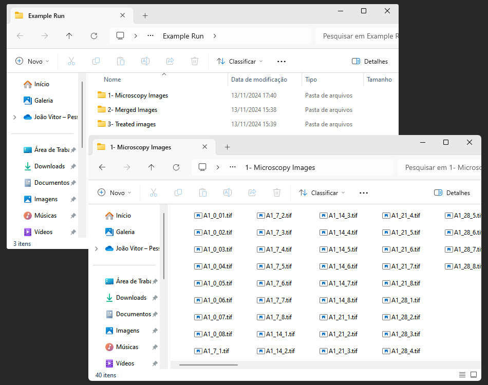
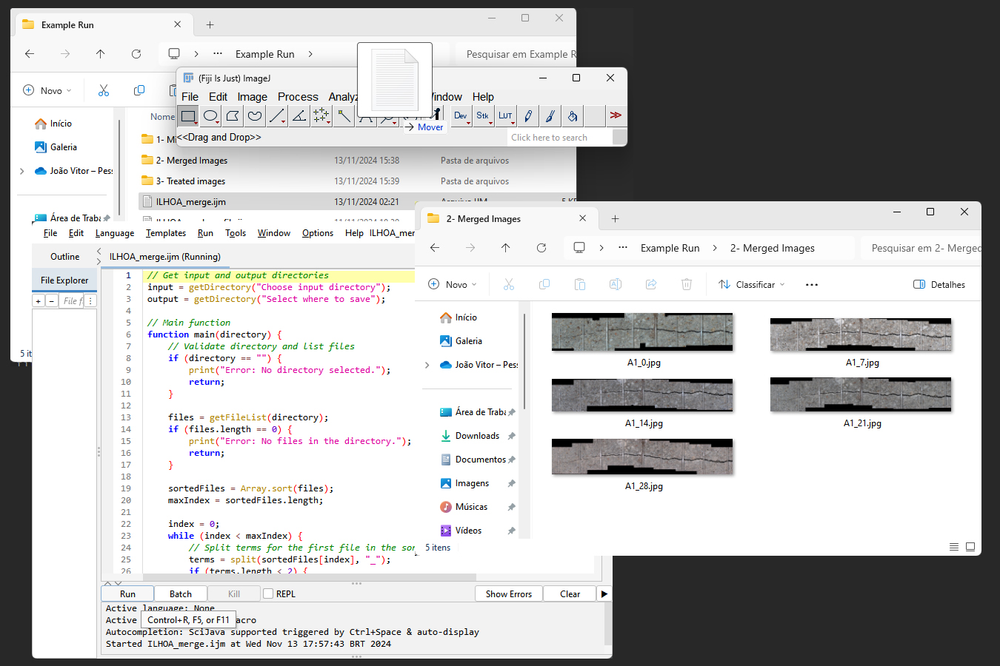
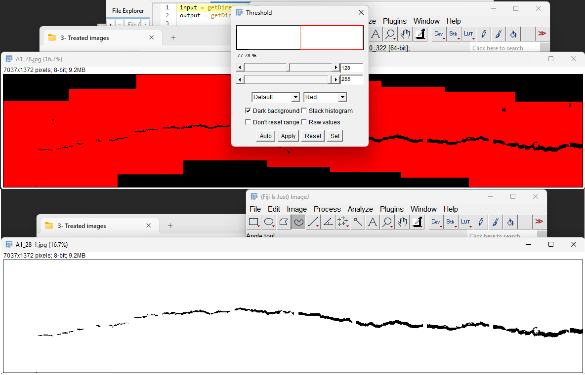

# **ILHOA - A Complete Pipeline for Concrete Crack Microscopy Analysis**

João Vitor B. Borowskia, Augusto Schranka, Marilene Vainsteina  

aDepartamento de Biologia Molecular e Biotecnologia, Instituto de Biociências and Programa de Pós-Graduação em Biologia Celular e Molecular, Centro de Biotecnologia, Universidade Federal do Rio Grande do Sul – UFRGS, Porto Alegre, RS 91500-970, Brazil.

---
#### Contact via: **ilhoa.contact@gmail.com**
---

### **Contents**
- [Description](#description)
- [Recommended Implementation](#recommended-implementation)
- [Example](#example)
- [Description of This GitHub Repository](#description-of-this-github-repository)
- [Why "ILHOA"](#why-ilhoa)
- [Citation](#citation)

---

## **Description** 
ILHOA (InstantLy Have Overall Analysis) is a robust and automated pipeline designed to analyse crack healing in self-healing concrete materials. Composed of Fiji and Python codes, it takes microscopy images as input and returns ready-to-publish graphics and statistical analysis of the whole crack extension. It offers precise and scalable tools for data acquisition, processing, and visualization, aiming to enhance research workflows by replacing manual assessments with automated and reproducible methodologies. 

## **Recommended Implementation**
1- Install [Fiji (ImageJ)](https://imagej.net/software/fiji/downloads) and all necessary Macros 

2- Install [Python 3.8.16](https://www.python.org/downloads/release/python-3816/) or [later versions](https://www.python.org/downloads/), and all necessary packages and their dependencies. All python code was run and tested with version 3.8.16

3- To run the Python code, we reccomend utilizing an IDE such as [PyCharm](https://www.jetbrains.com/pycharm/download/?section=windows)

## **Important**
> ⚠️ **Please Note**: Before using ILHOA, ensure that all microscopy image files have the right format, and are correctly named according to the guidelines provided in the [Example](#example) section. Incompatible format or improperly formatted data may cause the pipeline to fail. 
##
4- Open Fiji, drag the macro [ILHOA_merge.ijm](https://github.com/BOROWSKI-JoaoVitor/ILHOA/blob/main/ILHOA_merge.ijm) file into the program window and run the code

5- After creating all merged microscopy images, drag the macro [ILHOA_crack_profile.ijm](https://github.com/BOROWSKI-JoaoVitor/ILHOA/blob/main/ILHOA_crack_profile.ijm) file into the program window and run the code

6- After processing all images, open it with Fiji and manually exclude any remaining artifacts:

- Drag and drop the image in Fiji. Press *Ctrl + Shift + T*, select *Dark Background* and press *Apply*;
- With the *Freehand selections* tool, circle the unwanted artifacts and press *Del*;
- When you have only the crack profile left, press *Ctrl + Shift + T*, select *Dark Background** and press *Apply*;
- In the Fiji main menu go to *File > Save As > Jpeg* and save it in the same directory as the original (overwriting) or in a new directory.

7- Open the [ILHOA_data_extract.py](https://github.com/BOROWSKI-JoaoVitor/ILHOA/blob/main/ILHOA_data_extract.py) with the IDE of your choice. Run the code

8- Congratulations! You now have all the data ready to be interpreted! Good luck with your research 

## **Example**
Before running any codes, you should have the following directories:
- With microscopy images;
 
- To save the merged microscopy images;

- To save treated images (ready to be analysed).
---
The images in the directory must be named according to this format:
#### **Treat-#_Time _##**
Where 
- **<i>Treat</i>** is the treatment condition used for that sample;
- **<i>#</i>** is the sample identifier number;
- **<i>Time</i>** is the lapsed time from the beginning of the analysis when the photo was captured (in days);
- **<i>##</i>** is the image identifier number for sequential merge.
##
> ⚠️ **Please Note**: the underscore limitters must be used as shown in the example for the proper functioning of the program
## 

Here's an example of a directory with the images ready for analysis:

---
Executing the steps _1-4_ from the [Recommended Implementation](#recommended-implementation), you should get the following results:

Executing the steps _5 and 6_, you should get the following results:

After executing the step _7_, you will get the following graphics and results:
### **1 - Initial Withs Distribution**

An initial insight from the data analysis is the comparison of crack width distributions across all samples, which assesses the uniformity of their apertures. Aperture size is crucial for self-healing in concrete, as different aperture sizes can significantly impact healing efficacy. Figure 1 presents a density plot showing the distribution of crack widths among the samples. The plot indicates that most samples have similar width distributions, suggesting uniform structural characteristics. However, samples such as L05-R, L05-2, and L015-2 show distinct differences, highlighting the need for further scrutiny or adjustments in sample preparation or analysis.

### **2 - Line Plot - Raw Area**

Collecting multiple data points throughout the testing period is essential for a comprehensive assessment of the self-healing behavior of concrete embedded with self-healing agents. Documenting changes at various stages — early, mid, and late — allows researchers to capture the nuanced dynamics of the healing process, which can vary significantly over time. A robust timeline of data allows for the extrapolation of the general self-healing trend, offering a clearer picture of the agent’s efficacy and enabling more accurate predictions of its long-term performance. 

### **3 - Line Plot - Area Variation**

In the analysis of self-healing in concrete, line graphs showing both raw and Δ areas are crucial for evaluating and comparing the efficiency of different healing treatments. These graphs enable direct comparisons of healing progress over time across various treatments, highlighting the performance and efficacy of each approach. Figure 2 presents the raw area data, providing a snapshot of the actual crack sizes, while Figure 3 focuses on area variations, allowing for straightforward comparisons of treatment performances. 

### **4 - Generalized Estimating Equations (GEE)**
The Generalized Estimating Equations (GEE) approach is an effective statistical method for distinguishing performance differences, providing robust comparisons even when dealing with complex and correlated data sets.

### **5 - Violin Plot - Initial vs Final Areas**

### **6 - Bar Graph - Initial vs Final Areas**

### **7 - Scatter Plot - Final vs. Initial Crack Areas**

The continuous red line indicates where the initial crack area is equal to the final crack area. The segmented red line represents the 95% confidence interval calculated for the reference samples. Results falling between the continuous and segmented red lines indicate healing yields that are not statistically different from the reference samples, suggesting self-healing comparable to that expected from autogenous healing. Samples positioned below the segmented red line exhibit self-healing yields that surpass those of solely autogenous healing, indicating enhanced autonomous self-healing.

## **Description of This GitHub Repository**

This repository contains all necessary files, scripts, and documentation for running ILHOA. Below is a breakdown of the repository structure:

- **`logo_ILHOA.png`**: The ILHOA project logo, displayed at the top of the README as a visual identifier.
  
- **`Graphical_Abstract.jpg`**: A graphical summary of the ILHOA pipeline, providing a quick visual overview of its functionalities and workflow.

- **`images/`**: A folder containing example images used in the README for illustrative purposes, such as the directory structure, example Fiji outputs, crack profiles, and generated plots.

- **`ILHOA_merge.ijm`**: The Fiji macro script used to merge microscopy images. This script should be run in Fiji after setting up your images according to the specified format.

- **`ILHOA_crack_profile.ijm`**: The Fiji macro script for processing crack profiles in images. This script is used after merging to isolate the crack profile for further analysis.

- **`ILHOA_data_extract.py`**: A Python script that extracts data from processed images and generates various plots and statistical analyses, including density plots, line plots, GEE analysis, and scatter plots.

- **README.md**: This file, providing a comprehensive guide to using ILHOA, including setup instructions, examples, and citation information.

- **`assets/`** (Optional): A folder for storing any additional resources or data files required by the scripts or to be provided for demonstration purposes. You can also place here any downloadable files or sample datasets for users to test the pipeline.

Each file and folder serves a specific role in the analysis pipeline, from initial image processing to final data extraction and visualization. By following the instructions in this README, users can quickly set up ILHOA, process their images, and generate publication-ready graphics and analyses for self-healing concrete research.

## **Why "ILHOA"**
The name Ilhoa was selected prior to creating its acronym. As a pipeline integrating Fiji (named after a real island) and Python (named after a snake), it was inspired by a Brazilian island known for its unique snake population. Ilhoa is located in Rio de Janeiro, Brazil, home to the critically endangered Jararaca-ilhoa, or Golden Lancehead pit viper. This name choice is intended to raise awareness of endangered Brazilian species, spotlighting the importance of conservation efforts.

## **Citation**
J.V.B. Borowski, A. Schrank, M.H. Vainstein (2024) Ilhoa: A Novel Automated Pipeline for Enhanced Crack Analysis. Automation in Construction.
